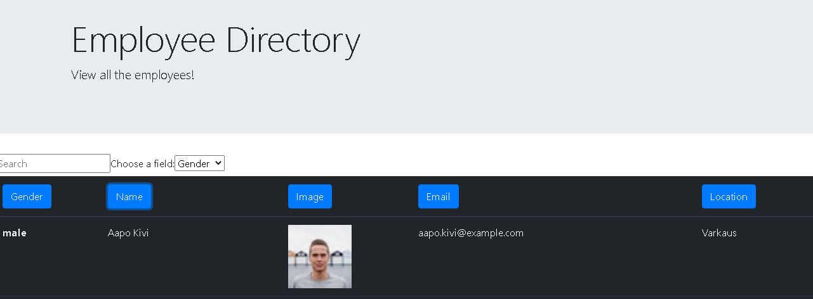

# employee-react-tracker

## Project Title

employee-react-tracker

## Project Link

- https://github.com/jamesrowe1/employee-react-tracker
- https://employee-db-react.herokuapp.com/

## Screenshot

## Getting Started

Begin by navigating to the heroku app website located above. Once there, you will see a list of employees and some information about them. You can see their Gender, Name, a Thumbnail, and Email, and their location. By clicking on each one of those options, you can sort by that field. Clicking again will sort them in reverse order.

You can also search on any of the fields by entering the information you are looking for in the Search Bar, and then choosing the field you would like to search on.

## Prerequisites

You must have a working web browswer.

## Built With

- Visual Studio Code
- JavaScript
- Node
  - Axios
  - React
- Code hosted by Github
- App hosted by Heroku

## Authors

James Rowe

## License

Licensed under Awesome Coding L.L.C. (not a real company)

## Troubleshooting

For any issues contact James Rowe

## Acknowledgments

- Ben Wright
- Justin Pinero
- Wilson Linares